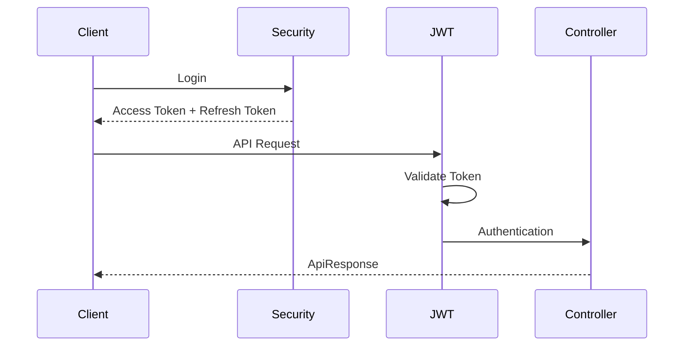
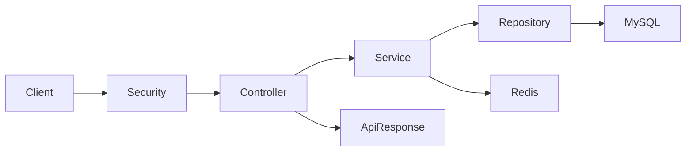

# 🚀 Backend Template

<div align="center">

# Spring Boot Authentication Template

**재사용 가능한 Spring Boot 백엔드 템플릿**

JWT · Spring Security · QueryDSL · Redis · Docker · Swagger

</div>

---

## 📌 프로젝트 소개

프로젝트를 새로 시작할 때마다 반복되는 인증, 보안, 예외 처리, 공통 응답 구조를
다시 구현하지 않기 위해 제작한 **Spring Boot 인증 템플릿**입니다.

이 템플릿은 실제 프로젝트에서 바로 사용할 수 있도록
회원 인증, JWT 기반 로그인, Refresh Token, QueryDSL, Docker, Redis 등
실무에서 자주 사용하는 기술을 미리 구성했습니다.

---

# ✨ 주요 기능

- ✅ JWT Access Token 인증
- ✅ JWT Refresh Token
- ✅ Spring Security 인증/인가
- ✅ Swagger(OpenAPI)
- ✅ Global Exception Handler
- ✅ ErrorCode 기반 예외 처리
- ✅ ApiResponse 공통 응답
- ✅ Validation
- ✅ BaseEntity + JPA Auditing
- ✅ QueryDSL
- ✅ Redis 연동 준비
- ✅ Docker / Docker Compose
- ✅ Profile(local/dev/prod) 분리

---

# 🛠 Tech Stack

| Category | Technology |
|-----------|------------|
| Language | Java 17 |
| Framework | Spring Boot 4 |
| Security | Spring Security, JWT |
| ORM | Spring Data JPA, QueryDSL |
| Database | MySQL |
| Cache | Redis |
| API Docs | Swagger(OpenAPI) |
| Container | Docker, Docker Compose |

---

# 📂 프로젝트 구조

```text
src
├── domain
│   └── user
│       ├── controller
│       ├── dto
│       │   ├── request
│       │   └── response
│       ├── entity
│       ├── repository
│       └── service
│
├── global
│   ├── config
│   ├── entity
│   ├── exception
│   ├── response
│   ├── security
│   │   ├── filter
│   │   ├── handler
│   │   ├── jwt
│   │   └── service
│   └── util
└── resources
```

---

# 🔐 JWT 인증 흐름



---

# 🏛 시스템 구조



---

# 📦 User Domain

- 회원가입
- 로그인
- JWT 발급
- Refresh Token 관리
- 사용자 조회
- 권한(Role) 관리

---

# 🧱 공통 응답 형식

```json
{
  "success": true,
  "code": "SUCCESS",
  "message": "요청이 성공했습니다.",
  "data": {}
}
```

---

# 🚨 예외 처리

```text
Controller
   ↓
Service
   ↓
CustomException
   ↓
GlobalExceptionHandler
   ↓
ApiResponse
```

---

# 🐳 Docker

```bash
docker compose up -d
```

실행 컨테이너

- MySQL
- Redis

---

# 🚀 실행 방법

```bash
git clone <repository>

cd backend-template

./gradlew bootRun
```

Swagger

```text
http://localhost:8080/swagger-ui/index.html
```

---

# 🌱 Git Branch Strategy

```text
main
└── develop
    ├── feature/auth
    ├── feature/user
    ├── feature/common
    └── feature/...
```

---

# 📝 Commit Convention

```text
feat
fix
refactor
docs
style
test
chore
```

---

# 💡 기술 선택 이유

| 기술 | 이유 |
|------|------|
| Spring Security | 표준 인증/인가 |
| JWT | Stateless 인증 |
| QueryDSL | 동적 검색 |
| Redis | 토큰/캐시 확장 |
| Docker | 개발환경 통일 |
| Swagger | API 문서 자동화 |

---

# 📈 Roadmap

- [x] JWT
- [x] Swagger
- [x] QueryDSL
- [x] Redis
- [x] Docker
- [ ] OAuth2 Login
- [ ] GitHub Actions
- [ ] AWS Deploy
- [ ] Monitoring
- [ ] Test Code

---

# 🔥 Trouble Shooting

개발 과정에서 발생한 문제와 해결 과정을 지속적으로 기록합니다.

- JWT 인증
- QueryDSL 설정
- Docker 환경 구성
- Redis 연동
- Spring Security
- JPA 성능 개선

---

# 📄 License

MIT License
